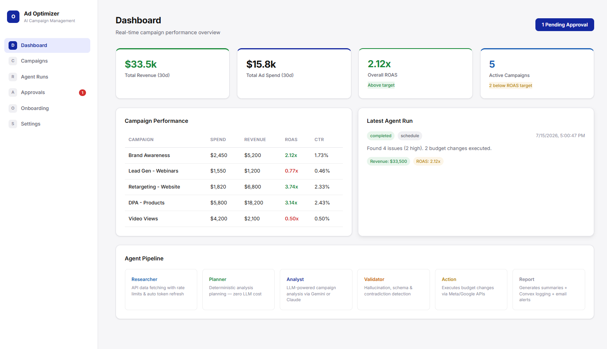

# AI Ad Campaign Optimizer

Multi-agent AI system that autonomously analyzes Meta Ads and Google Ads campaigns, detects anomalies, recommends budget shifts, and generates performance reports — all through a real-time React dashboard.

Built for agencies running paid media at scale. The AI pipeline runs on cron, logs every decision to Convex, and surfaces insights in a client-ready portal.



## Architecture

```
┌─────────────┐    ┌──────────┐    ┌──────────┐    ┌────────────┐    ┌────────┐    ┌────────┐
│  Researcher │───▶│  Planner │───▶│  Analyst │───▶│  Validator │───▶│  Action│───▶│  Report │
│  (API)      │    │  (Rules) │    │  (LLM)   │    │  (Checks)  │    │  (Exec)│    │  (Save) │
└─────────────┘    └──────────┘    └──────────┘    └────────────┘    └────────┘    └────────┘
       │                 │              │                  │               │              │
       ▼                 ▼              ▼                  ▼               ▼              ▼
   Meta/Google       Decides       Gemini/Claude     Halucination      Budget        Convex DB
   Ads APIs         what to        finds issues      + schema          changes       + Email
   + Shopify        analyze                          validation                      report
   + GA4
   + Klaviyo
```

### Agent Pipeline (6 steps)

| Agent | Role | Cost |
|-------|------|------|
| **Researcher** | Fetches campaigns from Meta & Google Ads APIs. Handles 429 rate limits, 401 token expiry, API timeouts. Collects Shopify revenue, GA4 attribution, Klaviyo email metrics. | $0 (API calls) |
| **Planner** | Deterministic rules decide what analysis to run (ROAS, budget, anomalies). | $0 (pure logic) |
| **Analyst** | Sends campaign data to LLM (Claude or Gemini), returns structured JSON findings. Auto-repairs malformed JSON, falls back across models. | ~2K tokens/run |
| **Validator** | Checks LLM output for hallucinated campaign IDs, missing fields, contradictory recommendations, negative values. | $0 |
| **Action** | Executes budget changes via Meta/Google APIs. Large changes (>$1000) route to human approval. | $0 (API calls) |
| **Report** | Generates structured summary, writes to Convex, sends email digest via Resend. | $0 |

### Key Features

- **Multi-tenant** — Every table indexed by `clientId`. Onboard new clients in minutes.
- **Rate limiting** — Token bucket: 200 req/hr for Meta, 5000 req/hr for Google. Exponential backoff with jitter.
- **Token refresh** — Auto-refresh Meta tokens via `fb_exchange_token`, Google via `refresh_token` grant.
- **LLM fallback** — Configure model rotation list. On failure, tries next model automatically.
- **Hallucination protection** — Validator cross-checks all LLM campaign IDs against source data.
- **Human approval** — Budget changes over threshold require approval via dashboard.
- **Audit trail** — Every agent decision logged to Convex `agentLogs` table.

## Tech Stack

- **Backend/Database:** Convex (serverless functions, real-time DB)
- **Frontend:** React 19 + TypeScript + Vite (deployed to Vercel / GitHub Pages)
- **AI/LLM:** Anthropic Claude + Google Gemini (via ModelRouter)
- **Integrations:** Meta Ads API, Google Ads API, Shopify, GA4, Klaviyo
- **Email:** Resend
- **Agent scripts:** Python + asyncio + httpx

## Quick Start

### Prerequisites

- Python 3.12+
- Node.js 20+
- Convex account (free tier: [convex.dev](https://convex.dev))
- API keys (at least one LLM provider)

### 1. Clone & Install

```bash
git clone https://github.com/mysterious75/ai-ad-campaign-optimizer.git
cd ai-ad-campaign-optimizer

# Python dependencies
pip install -r agents/requirements.txt

# Frontend dependencies
cd frontend && npm install && cd ..
```

### 2. Configure

```bash
cp .env.example .env
# Edit .env with your API keys:
# - GEMINI_API_KEY and/or ANTHROPIC_API_KEY
# - CONVEX_DEPLOYMENT_URL and CONVEX_ACCESS_KEY
# - META_ACCESS_TOKEN, GOOGLE_ACCESS_TOKEN (optional)
# - SHOPIFY_STORE_DOMAIN, SHOPIFY_ACCESS_TOKEN (optional)
# - GA4_PROPERTY_ID (optional)
# - KLAVIYO_API_KEY (optional)
# - RESEND_API_KEY (optional)
```

### 3. Deploy Convex Backend

```bash
cd convex
npx convex dev
npx convex deploy
```

### 4. Run the Agent Pipeline

```bash
# Full pipeline for all active clients (cron):
python -m agents.main

# Demo with sample data + real LLM:
python demo_full.py
```

### 5. Start Frontend

```bash
cd frontend
npm run dev
# → http://localhost:5173
```

### 6. Run Tests

```bash
python -m pytest tests/ -v
```

## Docker

```bash
docker compose up --build
```

Runs the agent pipeline in a container on an hourly cron schedule.

## Project Structure

```
├── agents/                      # Python agent pipeline
│   ├── main.py                  # Cron entrypoint
│   ├── supervisor.py            # 6-step orchestrator
│   ├── researcher_agent.py      # API fetching + rate limits + token refresh
│   ├── planner_agent.py         # Deterministic analysis planning
│   ├── analyst_agent.py         # LLM campaign analysis
│   ├── validator_agent.py       # Output quality checks
│   ├── action_agent.py          # Budget change execution
│   ├── report_agent.py          # Summary + Convex logging
│   ├── model_router.py          # Multi-model LLM router
│   ├── rate_limiter.py          # Token bucket + retry handler
│   ├── convex_client.py         # Convex HTTP client
│   ├── email_client.py          # Resend email integration
│   └── integrations/            # Shopify, GA4, Klaviyo clients
├── convex/                      # Convex backend (TypeScript)
│   ├── schema.ts                # 6-table schema
│   ├── campaigns.ts             # Campaign CRUD
│   ├── agentRuns.ts             # Run lifecycle
│   ├── agentLogs.ts             # Append-only audit log
│   ├── approvals.ts             # HITL approval flow
│   └── onboarding.ts            # Client onboarding state machine
├── frontend/                    # React dashboard
│   └── src/
│       ├── components/          # 6 pages
│       ├── lib/                 # Types, mock data, Convex context
│       └── index.css            # Dark theme styles
├── tests/                       # 29 pytest tests
├── demo_full.py                 # End-to-end demo script
└── .env.example                 # Environment template
```

## Live Demo

The frontend is live at: **https://mysterious75.github.io/ai-ad-campaign-optimizer/**

> *Note: Runs on mock data for demo purposes. Connect real API keys for production use.*

## License

MIT
